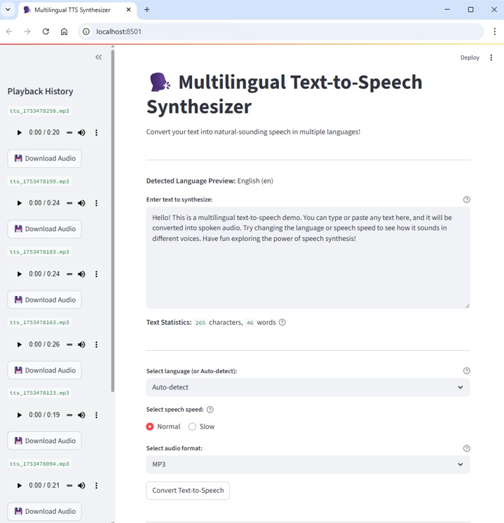

# 🗣️ Multilingual Text-to-Speech Synthesizer

This is a **`Streamlit` web application** that converts text into **natural-sounding speech** in **multiple languages** using `Google Text-to-Speech` (`gTTS`). The app supports **language auto-detection**, **speech speed control**, and *audio format selection** (MP3 or WAV). Users can enter or paste text, select a language or auto-detect it, and generate audio that can be played back or downloaded.


## Demo Screenshot

| Web Application - Multilingual Text-to-Speech Synthesizer                 |
| ------------------------------------------------------------------------- |
|  |


## Features

- Supports over 70 languages and accents.
- Auto language detection with fallback.
- Select normal or slow speech speed.
- Choose audio output format: MP3 or WAV.
- Preview and download generated audio.
- Keeps a playback history in a sidebar.
- Shows live text statistics (character and word count).
- Easy to use with a clean, responsive UI.


## Installation & Run (in a CLI)

1. Clone this repository:
```bash
git clone https://github.com/ntoningr/Multilingual_Text_to_Speech_Synthesizer.git
```
2. Change directory:
```bash
cd Multilingual_Text_to_Speech_Synthesizer
```

3. Install dependencies:
```bash
pip install -r requirements.txt
```

4. Run the web app:
```bash
streamlit run tts_app.py
```

Then open your browser at [http://localhost:8501](http://localhost:8501) to access the interface.


## Requirements

- `Python` 3.7+
- Internet access (required by `gTTS`)


## Dependencies

- [`streamlit`](https://streamlit.io/)
- [`gtts`](https://pypi.org/project/gTTS/)
- [`pydub`](https://pypi.org/project/pydub/)
- [`langdetect`](https://pypi.org/project/langdetect/)

See `requirements.txt` for full list.

